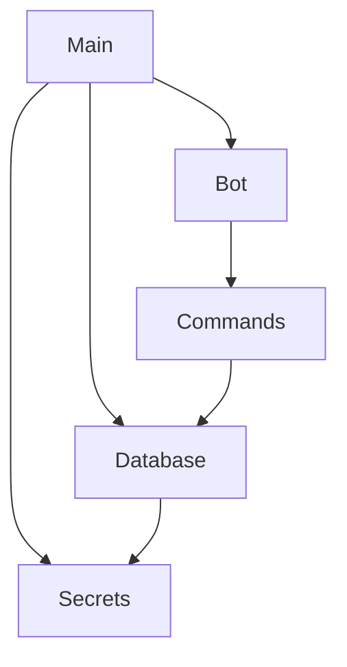
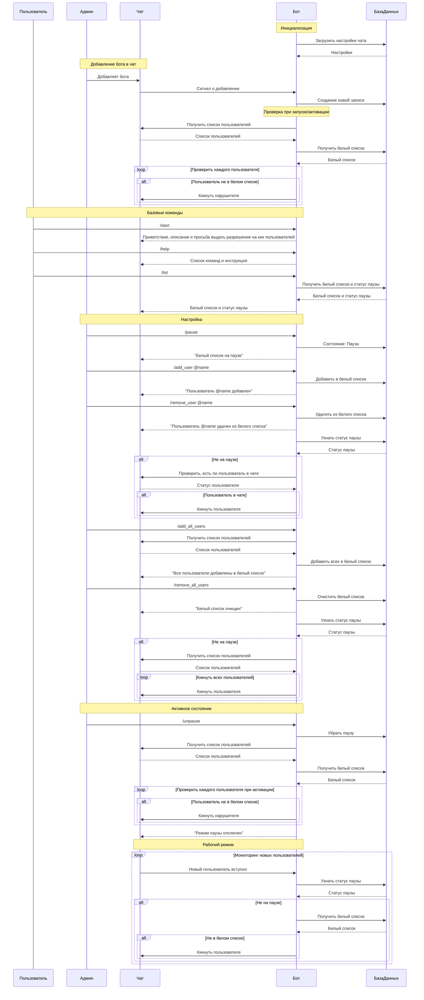

# Даша-бот
[Ссылка на GitHub](https://github.com/abakuntzz/whitelist_bot/)  
Данный telegram-бот предназначен для поддержания системы белого списка в чате. Пользователь сможет добавить бота в чат, в котором является админом, и использовать команды.  
|Команда|Функционал|Только админам?|
|-------|----------|:-----------------:|
|```/start```|Выводит приветствие, краткий обзор и рассказывает о ```/help```|-|
|```/help```|Выводит документацию всех команд|-|
|```/list```|Выводит действующий список и статус|-|
|```/add_user @name```|Добавляет пользователя ```name``` в список|+|
|```/remove_user @name```|Удаляет пользователя ```name``` из списка|+|
|```/pause```|Включает режим паузы (включен изначально)|+|
|```/unpause```|Отключает режим паузы|+|
|```/add_all_members```|Добавляет в список всех, кто сейчас в чате|+|
|```/remove_all_members```|Убирает из списка всех, кто сейчас в нём|+|
## Задачи
|Что|Сколько времени|Разработчик|  
|---|:-------------:|:---------:|
|Функционал команд|1 неделя|Арина|
|Взаимодействие с БД|1 неделя|Алина|
|Переход на облачную БД|3 дня|Алина|
|Docker|3 дня|Арина|
|Покрытие тестами|1 неделя|Алина|
|Логирование (опционально)|3 дня|Арина|  
## База данных

## Примерная иерархия пакетов

## Схема взаимодействия

